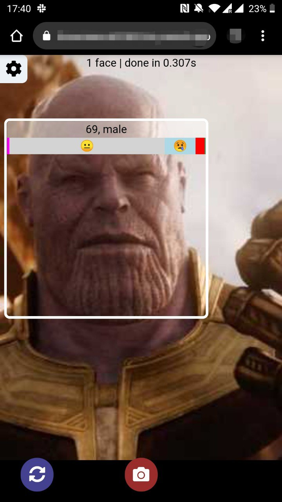

# Computer vision showcase

This is a React-based demo integration of some computer vision models that are available in browser. For now, it includes only the standard models that are included in [face-api.js](https://github.com/justadudewhohacks/face-api.js); more algorithms will be added later.

[**Live demo**](https://computer-vision-showcase.vercel.app/)

This has been inspired by [hownormalami.eu](https://www.hownormalami.eu/) ([posted on Hacker News](https://news.ycombinator.com/item?id=24637064) in September 2020).

## Local setup

Make sure you have installed node.js, NPM and Yarn. After cloning this repo, install dependencies:

```sh
yarn
```

Then run the development server (it will start on [port 3000](http://localhost:3000) by default:

```sh
yarn start
```

## Usage

You can either open the [existing demo](https://computer-vision-showcase.vercel.app/) or build and run the app locally. Enable the camera on your device to use this app.

This app reimplements [a subset of face-api.js's own demos](https://justadudewhohacks.github.io/face-api.js/) using React hooks. It will detect faces in and try to guess face expressions, age and gender.



You can change some of the model's settings by clicking the ⚙️ button at the top of the screen:

* You can choose between clicking a button every time you want to process the image vs. automatic ("real-time") processing. If the device doesn't support WebGL with hardware acceleration, the NN will work much slower (5-20 seconds vs. 0.3-0.7 seconds per run), so the automatic mode is turned off by default on such devices.
* You can play with the algorithm's minimum score threshold if it either fails to detect the faces or has too many false positives.
* You can switch between and turn on / off various face-api's features - including showing one face (with the best score) vs. multiple faces, switching between SSD Mobile Net v1 and Tiny Face Detector, turning on or off face expression / age / gender predictions. 

Try running it on your mobile too.

This app does not have a backend and it does not send any of your data outside the browser. 

## Further development

This is a list of things that one may want to try to add to this app:
* Run the neural network in a service workers to avoid blocking the main thread. Apparently, service workers [don't have the same level of GPU access](https://github.com/justadudewhohacks/face-api.js/issues/47) that the main thread has, so the processing will take longer, but this is still an interesting exercise.
* Expose other face-api.js features, i. e. face recognition and face landmark detection.
* Add other interesting publicly available pre-trained TensorFlow models.
* Add other computer vision algorithms. As an example [Tesseract](https://github.com/tesseract-ocr/tesseract) has a [JS port]((https://github.com/naptha/tesseract.js)) - it would be interesting to see how good it works in browser.